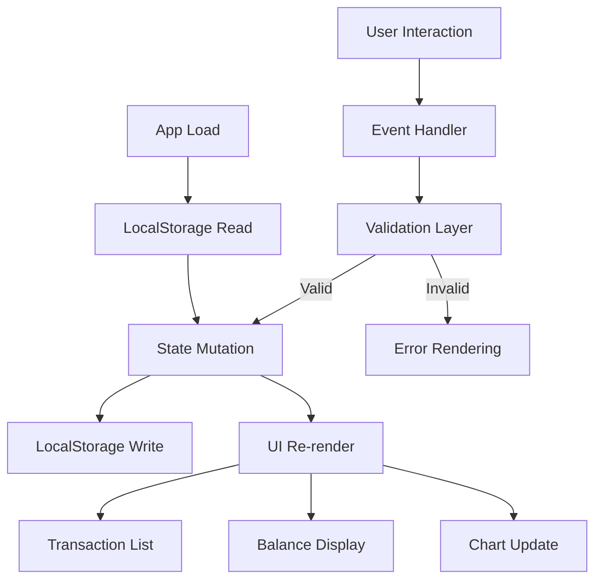

# Design Document: Expense & Budget Visualizer

## Overview

The Expense & Budget Visualizer is a fully client-side single-page application built with HTML, CSS, and vanilla JavaScript. It enables users to record personal expenses, view their spending distribution through a Chart.js pie chart, manage transactions (add/delete), and persist all data between sessions via the browser's LocalStorage API.

The application follows a dashboard layout inspired by modern banking UIs: a balance summary card at the top, a spending chart alongside the transaction list, and an input form with category management. Dark/light mode and transaction sorting are first-class features. There is no backend; the only external dependency is the Chart.js library loaded from a CDN.

### Key Technical Decisions

- **Vanilla JS with a module-like file structure**: A single `js/app.js` file organises all logic into clearly delineated sections (state management, storage, validation, rendering, event handling). No bundler or build step is required.
- **CSS custom properties for theming**: Dark and light themes are implemented via CSS `data-theme` attribute on `<html>`, toggling a predefined set of CSS variables. This avoids JavaScript-heavy style manipulation and enables sub-300ms theme switches.
- **Chart.js via CDN**: Avoids a build pipeline while still providing a fully featured charting library. The chart instance is held as a module-level variable and updated via `chart.data` mutation + `chart.update()`.
- **Defensive LocalStorage wrapper**: All reads and writes are wrapped in try/catch so that storage errors degrade gracefully without crashing the app.

---

## Architecture

The application is a single HTML file (`index.html`) with one external CSS file (`css/style.css`) and one external JS file (`js/app.js`). Chart.js is loaded from a CDN `<script>` tag.

```
expense-budget-visualizer/
├── index.html
├── css/
│   └── style.css
└── js/
    └── app.js
```

### Runtime Data Flow



### Application Lifecycle

1. **Load**: `DOMContentLoaded` fires → read theme from storage → apply theme to `<html>` → read transactions + categories → render all UI components.
2. **Add transaction**: validate → mutate in-memory state → write to storage → re-render list, balance, chart.
3. **Delete transaction**: show confirmation → on confirm, mutate state → write to storage → re-render.
4. **Toggle theme**: flip `data-theme` attribute → persist to storage.
5. **Sort**: update active sort key → re-render list only.
6. **Add custom category**: validate → mutate categories state → write to storage → re-render selector.

---

## Components and Interfaces

### HTML Structure (`index.html`)

```
<html data-theme="light">
  <head>
    <!-- Chart.js CDN, style.css link -->
  </head>
  <body>
    <header>
      <!-- App title, Theme_Toggle button -->
    </header>
    <main class="dashboard">
      <!-- Balance_Display card -->
      <section id="balance-section">
        <div id="balance-display">$0.00</div>
      </section>

      <!-- Chart section -->
      <section id="chart-section">
        <canvas id="spending-chart"></canvas>
        <p id="chart-empty-message" hidden>No spending data to visualise.</p>
      </section>

      <!-- Transaction Input Form -->
      <section id="form-section">
        <form id="transaction-form">
          <input id="item-name" type="text" maxlength="100" />
          <input id="amount" type="number" step="0.01" />
          <select id="category-select">
            <!-- built-in + custom options -->
          </select>
          <button type="submit">Add Transaction</button>
        </form>
        <!-- Custom category creation -->
        <form id="category-form">
          <input id="custom-category-name" type="text" maxlength="50" />
          <button type="submit">Add Category</button>
        </form>
      </section>

      <!-- Sort Control -->
      <section id="sort-section">
        <select id="sort-control">
          <option value="amount-asc">Amount: Low to High</option>
          <option value="amount-desc">Amount: High to Low</option>
          <option value="category-asc">Category: A–Z</option>
          <option value="category-desc">Category: Z–A</option>
        </select>
      </section>

      <!-- Transaction List -->
      <section id="list-section">
        <ul id="transaction-list">
          <!-- <li> per transaction or empty state message -->
        </ul>
      </section>
    </main>
  </body>
</html>
```

### JavaScript Module Layout (`js/app.js`)

| Section | Responsibilities |
|---|---|
| **Constants** | Storage keys (`STORAGE_KEY`, `CATEGORIES_KEY`, `THEME_KEY`), built-in category names, sort option values |
| **State** | `transactions[]`, `categories[]`, `activeSortKey` held as module-level variables |
| **Storage** | `loadTransactions()`, `saveTransactions()`, `loadCategories()`, `saveCategories()`, `loadTheme()`, `saveTheme()` — all wrapped in try/catch |
| **Validation** | `validateTransaction(name, amount, category)` → `{valid, errors}`, `validateCategoryName(name, existing)` → `{valid, error}` |
| **Business Logic** | `calculateBalance(transactions)`, `buildChartData(transactions)`, `sortTransactions(transactions, sortKey)` |
| **Rendering** | `renderList(transactions)`, `renderBalance(total)`, `renderChart(chartData)`, `renderCategorySelector(categories)`, `renderErrors(errors, container)` |
| **Event Handlers** | `onFormSubmit`, `onDeleteClick`, `onDeleteConfirm`, `onThemeToggle`, `onSortChange`, `onCategoryFormSubmit` |
| **Init** | `init()` — called on `DOMContentLoaded` |

### CSS Layout (`css/style.css`)

- CSS custom properties under `:root[data-theme="light"]` and `:root[data-theme="dark"]` define colour tokens.
- CSS Grid for the main dashboard layout. Single-column below 768px via `@media (max-width: 767px)`.
- All interactive controls have minimum touch target size of 44×44px.
- Theme transition: `transition: background-color 0.2s, color 0.2s` on `body` for smooth switch.

---

## Data Models

### Transaction Object

```js
{
  id: string,          // crypto.randomUUID() or Date.now().toString()
  name: string,        // 1–100 characters, at least one non-whitespace
  amount: number,      // positive finite number, max 999999999.99
  category: string,    // non-empty string matching a known category
  createdAt: string    // ISO 8601 timestamp, e.g. "2024-01-15T10:30:00.000Z"
}
```

### Category

Categories are stored as an array of strings in LocalStorage. Built-in categories (`["Food", "Transport", "Fun"]`) are hardcoded constants and never written to storage. Custom categories are persisted under `CATEGORIES_KEY`.

```js
// In memory: merged array
["Food", "Transport", "Fun", "Utilities", "Health"]

// In LocalStorage (CATEGORIES_KEY):
["Utilities", "Health"]   // custom categories only
```

### Chart Data (computed, never persisted)

```js
{
  labels: string[],   // e.g. ["Food", "Transport", "Uncategorized"]
  datasets: [{
    data: number[],   // sum of amounts per label, same order
    backgroundColor: string[]  // one colour per label
  }]
}
```

### Theme Preference

Stored under `THEME_KEY` as the string `"dark"` or `"light"`.

### Sort State

`activeSortKey` is one of `"amount-asc"`, `"amount-desc"`, `"category-asc"`, `"category-desc"`. Default is `"date-desc"` (most recent first). Sort state is in-memory only and resets to default on page load.

### LocalStorage Key Map

| Key | Value | Purpose |
|---|---|---|
| `ebv_transactions` | JSON array of Transaction objects | All user transactions |
| `ebv_categories` | JSON array of strings | Custom category names |
| `ebv_theme` | `"light"` or `"dark"` | User theme preference |

---

## Correctness Properties

*A property is a characteristic or behavior that should hold true across all valid executions of a system — essentially, a formal statement about what the system should do. Properties serve as the bridge between human-readable specifications and machine-verifiable correctness guarantees.*

### Property 1: Valid transaction submission adds exactly one entry

*For any* valid transaction input (name with at least one non-whitespace character up to 100 chars, positive finite amount ≤ 999,999,999.99, non-empty category), submitting the transaction form shall increase the transaction list length by exactly 1, and the new entry shall match the submitted values.

**Validates: Requirements 1.3**

---

### Property 2: Invalid item names are rejected

*For any* string composed entirely of whitespace characters (including the empty string), submitting the transaction form with that name shall be rejected with a validation error and the transaction list shall remain unchanged.

**Validates: Requirements 1.4**

---

### Property 3: Invalid amounts are rejected

*For any* amount value that is non-positive (≤ 0), non-numeric, or greater than 999,999,999.99, submitting the transaction form with that amount shall be rejected with a validation error and the transaction list shall remain unchanged.

**Validates: Requirements 1.6, 1.7**

---

### Property 4: Transaction list renders all required fields

*For any* non-empty set of transactions, every rendered transaction entry in the Transaction_List shall display the item name, the amount formatted to exactly two decimal places, the category label, and the date added.

**Validates: Requirements 2.1**

---

### Property 5: Default load order is most-recent-first

*For any* set of transactions with distinct `createdAt` timestamps stored in LocalStorage, when the application loads with the default sort, the Transaction_List shall display them ordered from the most recent timestamp to the oldest.

**Validates: Requirements 2.2**

---

### Property 6: New transaction appears at the top (default sort)

*For any* existing transaction list under the default (date-descending) sort, adding a new valid transaction shall place that new transaction at position 0 of the displayed list, since it has the most recent timestamp.

**Validates: Requirements 2.3**

---

### Property 7: Every transaction entry has a delete control

*For any* non-empty transaction list rendered in the Transaction_List component, every list entry shall contain a functioning delete control element.

**Validates: Requirements 3.1**

---

### Property 8: Delete confirmation prompt identifies the transaction

*For any* transaction in the list, activating its delete control shall produce a confirmation prompt whose text contains both that transaction's item name and its formatted amount.

**Validates: Requirements 3.2**

---

### Property 9: Confirmed deletion removes transaction from state and storage

*For any* transaction present in the in-memory state and in LocalStorage, confirming its deletion shall result in: (a) that transaction's id no longer present in the in-memory list, and (b) that transaction's id no longer present in the JSON stored under `STORAGE_KEY`.

**Validates: Requirements 3.3**

---

### Property 10: Cancelled deletion leaves state and storage unchanged

*For any* application state (any transaction list, any balance value), cancelling a delete confirmation prompt shall leave the in-memory transaction list, the LocalStorage contents, the Balance_Display value, and the Chart data all identical to their state before the prompt was shown.

**Validates: Requirements 3.4**

---

### Property 11: Balance equals sum of all transaction amounts

*For any* list of transactions (including lists containing negative amounts and the empty list), the Balance_Display shall show exactly the arithmetic sum of all `amount` fields, formatted to two decimal places with the currency symbol.

**Validates: Requirements 4.1, 4.4, 4.5**

---

### Property 12: Chart segments correspond 1-to-1 with active categories

*For any* non-empty set of transactions, `buildChartData` shall return exactly one segment per unique category label present in those transactions (using `"Uncategorized"` for transactions with no assigned category), and each segment's value shall equal that category's total amount.

**Validates: Requirements 5.1, 5.5**

---

### Property 13: LocalStorage round-trip preserves transaction data

*For any* transaction object, serialising it to JSON and then parsing the resulting JSON shall produce an object with identical `id`, `name`, `amount`, `category`, and `createdAt` fields.

**Validates: Requirements 6.6**

---

### Property 14: App load restores persisted transactions

*For any* non-empty array of valid transaction objects written to LocalStorage under `STORAGE_KEY`, initialising the application shall restore that exact array to in-memory state and render all entries in the Transaction_List.

**Validates: Requirements 6.3**

---

### Property 15: Theme preference round-trip

*For any* theme value (`"light"` or `"dark"`), writing that value to LocalStorage under `THEME_KEY` and then loading the application shall result in the `data-theme` attribute on `<html>` matching that stored value before any content renders.

**Validates: Requirements 7.3**

---

### Property 16: Valid custom category names are accepted

*For any* string of length 1–50 containing at least one non-whitespace character that does not case-insensitively match any existing built-in or custom category, creating that category shall succeed and the new category shall appear in the Input_Form category selector alongside all built-in categories.

**Validates: Requirements 8.1, 8.2**

---

### Property 17: Duplicate category names are rejected (case-insensitive)

*For any* existing category name (built-in or custom), attempting to create a new category whose name matches that existing name under case-insensitive comparison shall be rejected with an error message and no new category shall be added.

**Validates: Requirements 8.4**

---

### Property 18: Custom categories round-trip through LocalStorage

*For any* non-empty list of successfully created custom categories persisted to LocalStorage under `CATEGORIES_KEY`, loading the application shall restore all those categories to the in-memory category list and make them available in the Input_Form category selector.

**Validates: Requirements 8.3**

---

### Property 19: Sorted transaction list satisfies the ordering predicate

*For any* non-empty list of transactions and any of the four sort options, `sortTransactions(transactions, sortKey)` shall return a list where every adjacent pair of entries satisfies the ordering predicate for that sort option, with date-descending as the tiebreaker for equal sort keys.

**Validates: Requirements 9.2, 9.4**

---

### Property 20: Sorting with an active option re-applies after adding a transaction

*For any* sorted transaction list and any valid new transaction added while a non-default sort option is active, the resulting displayed list shall satisfy the same ordering predicate as Property 19 for the active sort option.

**Validates: Requirements 9.3**

---

## Error Handling

| Error Condition | Detection | User-Visible Response | Internal Behaviour |
|---|---|---|---|
| Empty / whitespace-only item name | Validation before submit | Inline error below name field | Form submission blocked |
| Non-positive or non-numeric amount | Validation before submit | Inline error below amount field | Form submission blocked |
| Amount exceeds 999,999,999.99 | Validation before submit | Inline error below amount field | Form submission blocked |
| No category selected | Validation before submit | Inline error below selector | Form submission blocked |
| Duplicate custom category (case-insensitive) | Validation before category creation | Inline error below category input | Category creation blocked |
| Invalid category name (empty / whitespace / too long) | Validation before category creation | Inline error below category input | Category creation blocked |
| LocalStorage write failure (transactions) | try/catch around `localStorage.setItem` | Toast/banner: "Could not save data. Changes may not persist." | In-memory state retains change; retry not attempted |
| LocalStorage read failure on load | try/catch around `localStorage.getItem` / `JSON.parse` | Banner: "Could not load saved data." | App initialises with empty state |
| LocalStorage malformed JSON on load | try/catch around `JSON.parse` | Banner: "Saved data is corrupted. Starting fresh." | App initialises with empty state |
| LocalStorage write failure (deletion) | try/catch around `localStorage.setItem` | Toast: "Deletion could not be saved to storage." | Transaction remains in list; in-memory state not mutated |
| LocalStorage read failure (categories) | try/catch around read/parse | Warning: "Could not load custom categories." | Falls back to built-in categories only |

All error messages are rendered in a visible, dismissible element. Errors do not crash the application.

---

## Testing Strategy

### Dual Testing Approach

Testing for this feature combines **example-based unit tests** for concrete behaviours and edge cases with **property-based tests** for universal correctness guarantees across large input spaces. Both layers are complementary.

### Unit Tests (Example-Based)

Focus areas:
- Form renders with correct fields (name, amount, category selector with built-ins).
- Sort control contains exactly 4 options with correct labels.
- Empty storage on load → empty state message shown in Transaction_List.
- Empty storage on load → balance displays `$0.00`.
- Empty storage on load → chart canvas hidden, empty message shown.
- After successful add → form fields are cleared.
- Theme toggle from light → dark changes `data-theme` to `"dark"`.
- Theme toggle from dark → light changes `data-theme` to `"light"`.
- No stored theme → defaults to light mode.
- Sort control retains selection when transaction list is empty.
- LocalStorage unavailable on load → error banner shown, in-memory list is empty.
- LocalStorage unavailable on delete → error toast shown, transaction remains in list.

### Property-Based Tests

**Library**: [fast-check](https://github.com/dubzzz/fast-check) (JavaScript/TypeScript)

**Configuration**: Minimum **100 runs** per property test (`{ numRuns: 100 }` in fast-check).

Each test is tagged with a comment referencing the design property it validates:
```
// Feature: expense-budget-visualizer, Property N: <property text>
```

Property tests to implement (one test per property, referencing the Correctness Properties section above):

| Property | Test Subject | Generator Strategy |
|---|---|---|
| **P1** Valid submission adds one entry | `validateTransaction` + state mutation | `fc.string({ minLength: 1 })` filtered non-whitespace, `fc.float({ min: 0.01, max: 999999999.99 })`, arbitrary category |
| **P2** Whitespace names rejected | `validateTransaction` | `fc.stringOf(fc.constantFrom(' ', '\t', '\n', '\r'))` |
| **P3** Invalid amounts rejected | `validateTransaction` | `fc.oneof(fc.float({ max: 0 }), fc.string())`, plus amounts > 999999999.99 |
| **P4** List renders all required fields | `renderTransaction` (pure render helper) | `fc.array(transactionArb)` |
| **P5** Default load order is most-recent-first | `sortTransactions(txs, "date-desc")` | `fc.array(transactionArb, { minLength: 2 })` with distinct timestamps |
| **P6** New tx at top (default sort) | state add logic | existing list + new valid transaction |
| **P7** Every entry has delete control | `renderList` | `fc.array(transactionArb, { minLength: 1 })` |
| **P8** Delete prompt contains name + amount | confirmation generation | `fc.record({ name: fc.string(), amount: fc.float() })` |
| **P9** Confirmed delete removes from state + storage | delete handler | `fc.array(transactionArb, { minLength: 1 })`, pick random index |
| **P10** Cancel leaves state unchanged | cancel handler | full state snapshot before/after |
| **P11** Balance equals sum | `calculateBalance` | `fc.array(fc.float({ noNaN: true, noDefaultInfinity: true }))` |
| **P12** Chart segments = unique categories | `buildChartData` | `fc.array(transactionArb, { minLength: 1 })` |
| **P13** JSON round-trip | JSON serialisation | `fc.record({ id, name, amount, category, createdAt })` |
| **P14** App load restores persisted data | `loadTransactions` | `fc.array(transactionArb, { minLength: 1 })` |
| **P15** Theme preference round-trip | `loadTheme` / `saveTheme` | `fc.constantFrom("light", "dark")` |
| **P16** Valid custom category accepted | `validateCategoryName` + state mutation | filtered string 1–50 chars with non-whitespace |
| **P17** Duplicate category rejected (case-insensitive) | `validateCategoryName` | existing name + case variations via `fc.string()` |
| **P18** Custom categories round-trip | `loadCategories` / `saveCategories` | `fc.array(validCategoryNameArb, { minLength: 1 })` |
| **P19** Sorted list satisfies ordering predicate | `sortTransactions` | `fc.array(transactionArb, { minLength: 2 })`, all 4 sort keys |
| **P20** Sort re-applies after add | state add logic under active sort | sorted list + new valid transaction |

### Integration / Manual Tests

- Cross-browser functionality check (Chrome, Firefox, Edge, Safari) — manual.
- Responsive layout at 320px, 768px, 1024px, 2560px — manual/visual.
- Touch event responsiveness on mobile — manual.
- No flash of unstyled content on page load — manual observation.
- Chart.js renders correctly in all supported browsers — manual.
